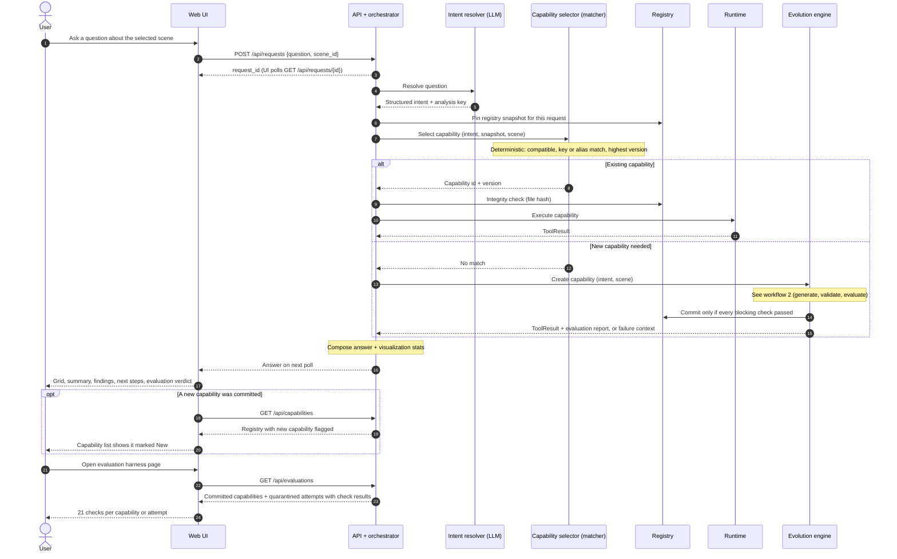
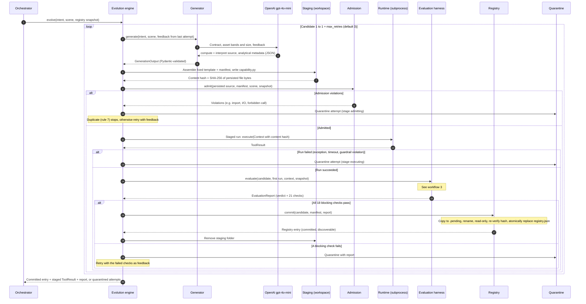
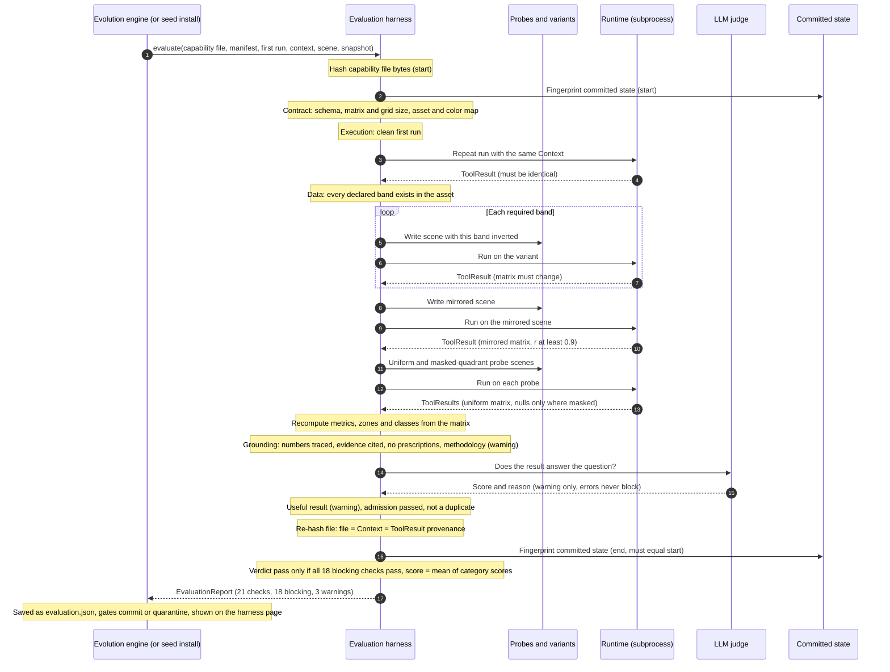

# AgriMon · Workflows

Three sequence diagrams, from the outside in:

1. [Master workflow](#1-master-workflow): question → capability selection (existing or new) → answer and harness updates.
2. [Evolution engine](#2-evolution-engine): how a new capability is generated, validated and committed or quarantined.
3. [Evaluation harness](#3-evaluation-harness): how one candidate is evaluated against 21 checks.

Invariant across all three: a failure at any step leaves committed capabilities byte-identical and
does not stop the next request.

## 1. Master workflow

## 2. Evolution engine

## 3. Evaluation harness

